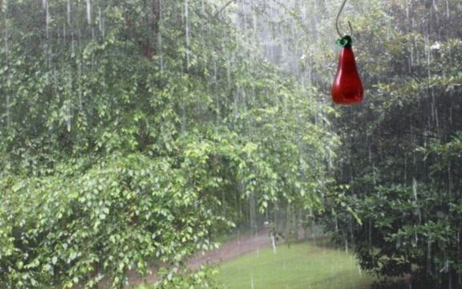

# Single-image-rain-removal-boosting-via-directional-gradient
##  How to model rainy images (DiG-CoM)

Suppose a rainy image **I** can be decomposed into 3 parts: background **B** which is what we need, a residual layer (rain layer) **R** and an edge layer **E**  to store details. Mathmatically, it can be formulated below:

To better decompose, as it's the case in many papers, we construct four constraints:

- Consistency: 
- Smooth constraint for background: 
- constraints for rain layer: 
- constraints for edge layer: 

In DiG-CoM, the parameter  is set adaptively according to a metric for rain streaks below

An overflow of optimization can be seen below

## Usage

## A Demo

## Some results on real rainy scene

    

## Discussion
