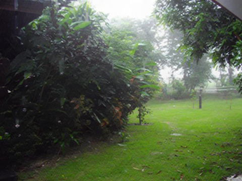

# Set-vanish-to-the-rain
use demo.m to run the deraining demo.
You can test your own img by adding you image to folder imgs, note that the format should be png, or you can change the format in demo.m to jpg format or other formats.

>* Source code of the ICME2020 oral accepted paper: Single Image Deraining Boosting via Directional Gradient
>* C/MATLAB
>* Optimization based efficient method
>* Some details or errors will be released later

Some visual results of real scene

    

